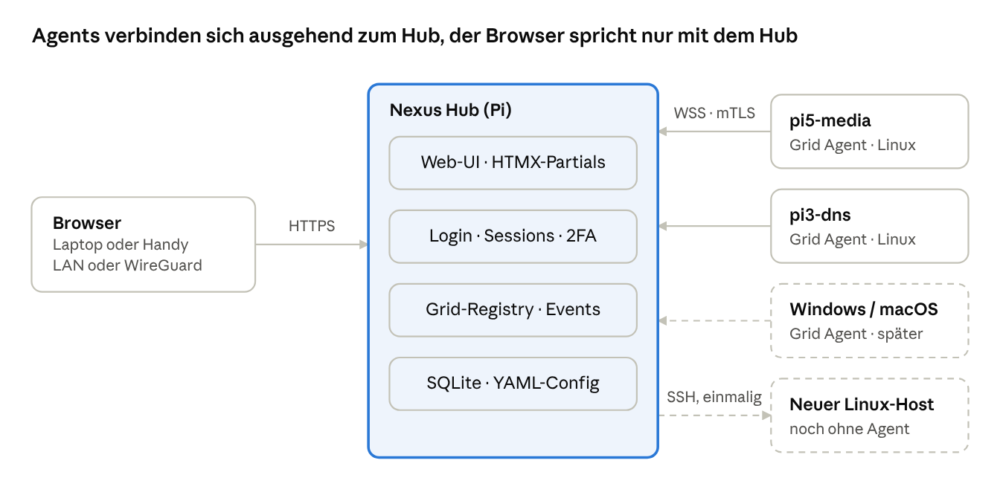
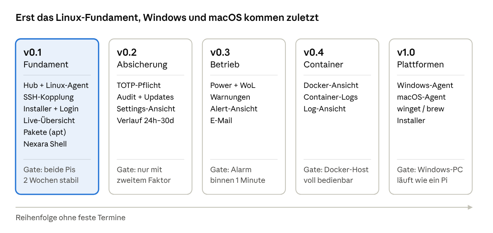

# Nexara Nexus – Konzept

Stand: 29.09.2026 · phabioo

## Ziel & Rahmen

Nexara Nexus ist ein schlankes, selbst gehostetes Dashboard, mit dem ich meine Rechner im Heimnetz überwache und verwalte: Systemwerte, Pakete, Dienste, Power und eine Shell, alles in einer Oberfläche.

- **Nutzer:** ich selbst. Freunde betreiben bei Bedarf ihre eigene Instanz bei sich zu Hause, es gibt keinen geteilten Hub.
- **Umgebung:** nur Heimnetz. Zugriff von unterwegs ausschließlich über WireGuard-VPN (ist bereits vorhanden).
- **Plattformen:** zuerst Linux (Raspberry Pi OS / Debian), später Windows und macOS über denselben Agenten.
- **Leitlinie:** ein Binary pro Rolle, keine Cloud, kein Node/Build-Schritt, sicher per Voreinstellung.

**Bewusst nicht Teil von Nexus:** Cloud-Anbindung, Telemetrie, Mandantenfähigkeit, öffentliche Erreichbarkeit ohne VPN, Konfigurationsmanagement à la Ansible, Monitoring-Stacks wie Prometheus/Grafana.

## Architektur

Nexus besteht aus zwei Go-Programmen: einem zentralen **Hub** und einem **Grid Agent** pro verwaltetem Gerät. Neue Linux-Hosts werden hybrid angebunden: einmal per SSH, danach nur noch über den Agenten.



Die Agents öffnen keine Ports. Sie bauen die Verbindung selbst zum Hub auf, der Browser spricht ausschließlich mit dem Hub.

- **Nexus Hub:** ein Binary auf dem Pi 5 (`frpi5`). Liefert Oberfläche und API, verwaltet Benutzer, Hosts und Verlauf, verteilt Befehle an die Agents und empfängt deren Messwerte. Der Hub-Pi bekommt selbst ebenfalls einen Grid Agent und erscheint als normaler Host.
- **Grid Agent:** ein Binary pro Gerät als Systemdienst. Sammelt Messwerte, führt nur fest definierte Aktionen aus (Pakete, Dienste, Power, Docker) und stellt die Shell bereit. Pro Betriebssystem eigene Umsetzung hinter derselben Schnittstelle.
- **Nexara Shell:** interaktive PTY-Sitzung auf dem Agenten, vom Hub per WebSocket zum Browser durchgereicht, dort mit xterm.js dargestellt.

**Kopplung eines neuen Hosts (hybrid)**

1. Im Add-Host-Fenster Adresse, SSH-Port, Benutzer und einmalig Passwort oder Schlüssel eingeben.
2. Der Hub verbindet sich per SSH, erkennt OS und Architektur und kopiert das passende Agent-Binary samt systemd-Unit.
3. Der Agent startet mit einem einmaligen Kopplungscode und meldet sich beim Hub.
4. Der Hub stellt ihm ein Client-Zertifikat aus, ab dann läuft alles über mTLS.
5. Der SSH-Zugang wird verworfen. Das Passwort wird nie gespeichert.

Für Windows, macOS oder Hosts ohne SSH gibt es den manuellen Weg: Agent installieren und `grid-agent enroll --hub <adresse> --token-file <datei>` ausführen (Code im Format `GRID-XXXX-XXXX-XXXX-XXXX`; `--token <code>` geht auch, landet aber in der Prozessliste).

## Techstack

Der ursprüngliche Stack (Go + serverseitiges HTML + HTMX + Plain CSS + YAML) bleibt die Basis. Ergänzt werden SQLite für Zustand, xterm.js für die Shell und ein kleiner Satz Go-Bibliotheken.

| Bereich | Wahl | Warum |
| --- | --- | --- |
| Sprache | Go (aktuelle Version) | Ein statisches Binary, Cross-Compile für arm64, amd64, Windows, macOS |
| HTTP & Routing | `net/http` mit Muster-Routing der Standardbibliothek | Kein Framework nötig |
| Templates | `html/template` + `embed` | Automatisches Escaping, Assets im Binary |
| Interaktion | HTMX + SSE-Erweiterung | Seitenteile austauschen, Live-Werte als HTML-Fragmente, kein Build-Schritt |
| Shell im Browser | xterm.js über WebSocket | Einzige echte JS-Abhängigkeit neben HTMX |
| Styling | Plain CSS mit CSS-Variablen, selbst gehostete Schriften | Setzt DESIGN.md direkt um, läuft offline |
| Hub ↔ Agent | WebSocket (`coder/websocket`) mit JSON-Nachrichten über mTLS | Leichtgewichtig, bidirektional, ausgehend vom Agenten |
| Zustand | SQLite über `modernc.org/sqlite` | Reines Go ohne CGO, einfache Sicherung als eine Datei |
| Konfiguration | YAML (`nexus.yaml`, `agent.yaml`) | Nur Startwerte, von Hand editierbar |
| Messwerte | `gopsutil` | CPU, RAM, Disks, Netz, Prozesse auf allen drei Betriebssystemen |
| Shell auf dem Gerät | `creack/pty` (Linux/macOS), ConPTY (Windows) | Echte interaktive Sitzung |
| Dienste | systemd über D-Bus (`coreos/go-systemd`) | Status und Neustart ohne Shell-Parsing |
| SSH-Bootstrap | `golang.org/x/crypto/ssh` | Einmalige Installation des Agenten |
| Passwörter & 2FA | argon2id (`x/crypto`), TOTP (`pquerna/otp`) | Aktueller Standard, klein |
| Docker | Docker Engine API über den Unix-Socket | Kein Docker-CLI-Parsing |

Paketverwaltung läuft hinter einer Schnittstelle mit einer Umsetzung pro System: zuerst `apt`, später `dnf`/`pacman`, `winget` und `brew`. Dasselbe Muster gilt für Dienste (systemd, Windows-Dienste, launchd) und Power.

## Daten & Speicherung

YAML enthält nur, was vor dem ersten Start feststehen muss. Alles, was die Oberfläche anlegt oder ändert, liegt in einer SQLite-Datei auf dem Hub.

**YAML-Dateien**

- `nexus.yaml` (Hub): Listen-Adresse und Port, Pfad zur Datenbank, TLS-Modus, Aufbewahrung des Verlaufs, Schwellwerte für Warnungen.
- `agent.yaml` (Agent): Hub-Adresse, Pfade zu Zertifikat und Schlüssel, Messintervall, erlaubte Aktionen (z. B. Docker aus).

**SQLite-Tabellen (Hub)**

| Tabelle | Inhalt |
| --- | --- |
| `users` | Operator-ID, argon2id-Hash, TOTP-Secret (verschlüsselt), Rolle |
| `sessions` | Session-ID (gehasht), Benutzer, Ablauf, letzte Aktivität, Client-Infos |
| `hosts` | Name, Adresse, OS, Architektur, Zertifikats-Fingerprint, MAC für Wake-on-LAN, Status |
| `enroll_tokens` | Einmalige Kopplungscodes mit Ablaufzeit |
| `metrics_1m` | Minutenwerte pro Host: CPU, RAM, Temperatur, Netz, Disks |
| `metrics_1h` | Stundenwerte für den Langzeitverlauf |
| `alerts` | Regeln und ausgelöste Warnungen mit Zeitpunkt und Quittierung |
| `audit_log` | Wer hat wann was auf welchem Host ausgeführt, mit Ergebnis |

**Messverlauf:** Live-Werte (alle 2 Sekunden) hält der Hub nur im Speicher als Ringpuffer. In die Datenbank gehen Minutenmittel für 7 Tage und Stundenmittel für die eingestellte Dauer (Standard 1 Jahr). Das schont auch SD-Karten.

**Sicherung:** Die SQLite-Datei, `nexus.yaml` und der CA-Schlüssel reichen für eine vollständige Wiederherstellung.

## Sicherheit

Nexus ist faktisch ein Root-Zugang zu allen Geräten. Deshalb gilt: erreichbar nur im Heimnetz oder per WireGuard, jede Verbindung verschlüsselt, jede Aktion protokolliert.

**Zugang zum Hub**

- Login mit Operator-ID und Passphrase, gespeichert als argon2id-Hash.
- TOTP als zweiter Faktor, ab Version 0.2 Pflicht.
- Session-Cookie mit `HttpOnly`, `Secure`, `SameSite=Strict`, Ablauf nach 12 Stunden Inaktivität.
- „Keep me signed in on this device“: Ohne Haken ist das Cookie ein Browser-Sitzungscookie und endet mit dem Schließen des Browsers. Mit Haken bekommt es ein festes Ablaufdatum und übersteht Neustarts von Browser und Handy. In beiden Fällen gelten die 12 Stunden Inaktivität und eine maximale Laufzeit von 30 Tagen, danach ist ein neuer Login mit zweitem Faktor nötig. Der Haken merkt sich kein Gerät für TOTP.
- CSRF-Token in jedem schreibenden Request (HTMX schickt ihn als Header mit).
- Login-Rate-Limit pro IP und pro Konto, Sperre nach mehreren Fehlversuchen.
- Strenge Security-Header (CSP ohne Inline-Skripte, `frame-ancestors 'none'`).

**Transport**

- Hub ↔ Browser: HTTPS mit eigenem Zertifikat des Hubs.
- Hub ↔ Agent: mTLS. Der Hub ist seine eigene kleine CA und stellt jedem Agenten beim Koppeln ein Zertifikat aus. Ein entfernter Host wird widerrufen.

**Rechte auf den Geräten**

- Der Hub läuft als eigener Benutzer mit systemd-Härtung. Der Agent läuft als root-Systemdienst ohne weitere Härtung, weil er apt, Dienste und Power bedient und die Shell `sudo` erlauben muss (`NoNewPrivileges` oder `ProtectSystem` würden genau das verhindern). Die Absicherung liegt in der festen Aktionsliste.
- Er kennt nur fest definierte Aktionen. Es gibt keinen Befehl „führe beliebigen Code als root aus“.
- Die Shell startet als der bei der Einrichtung des Pi angelegte Benutzer mit sudo, kein direkter root-Login.
- Pro Host lässt sich jede Fähigkeit abschalten (z. B. Shell oder Docker).

**Zugriff von außen:** ausschließlich über das vorhandene WireGuard ins Heimnetz. Nexus selbst wird nicht öffentlich freigegeben.

**Nachvollziehbarkeit:** Jede Aktion (Update, Neustart, Shell-Sitzung, Login, Kopplung) landet mit Benutzer, Host, Zeit und Ergebnis im Audit-Log.

## Ersteinrichtung des Hubs

Ein frischer Hub startet im Setup-Modus und lässt sich nur mit einem einmaligen Setup-Code aus der Konsole beanspruchen. So kann niemand anderes im Heimnetz die Installation übernehmen.

**Installation auf frpi5**

1. Einmalig im Terminal den Installer ausführen (siehe „Installation, Updates & Betrieb“). Er richtet Benutzer, Verzeichnisse und den systemd-Dienst `nexus` ein und startet ihn.
2. Beim ersten Start erzeugt der Hub seine CA, ein HTTPS-Zertifikat, den Schlüssel für Geheimnisse und eine leere Datenbank.
3. Der Installer zeigt am Ende Adresse, Setup-Code (8 Zeichen, 60 Minuten gültig) und den Fingerabdruck des Zertifikats an. Der Code steht zusätzlich im Journal.
4. Solange kein Operator existiert, zeigt jede Adresse nur den Setup-Assistenten, alle anderen Seiten und die Agent-Schnittstelle sind gesperrt.

**Setup-Assistent (7 Schritte)**

1. **Unlock:** Setup-Code eingeben, alternativ „Restore from backup“.
2. **Trust:** CA-Zertifikat für dieses Gerät und per QR-Code fürs Handy herunterladen, damit keine Browser-Warnungen mehr kommen. Überspringbar.
3. **Operator:** Operator-ID und Passphrase (mindestens 12 Zeichen) anlegen.
4. **Two-factor:** TOTP per QR-Code einrichten und mit einem Code bestätigen. In v0.1 überspringbar, ab v0.2 Pflicht.
5. **Hub:** Name, Zeitzone, Adresse und Port für die Agents, Aufbewahrung des Stundenverlaufs. Wird in `nexus.yaml` geschrieben.
6. **Self-link:** Grid Agent auf dem Hub-Pi installieren und seine Fähigkeiten wählen (Standard: an).
7. **Ready:** Zusammenfassung, danach ist der Setup-Modus geschlossen und der Code ungültig.

**Ablauf und Erneuerung des Setup-Codes**

- Läuft ein Code ab, bleibt der Hub einfach im Setup-Modus. Es passiert nichts weiter.
- Der Hub erzeugt alle 60 Minuten automatisch einen neuen Code und schreibt ihn ins Journal, der alte wird ungültig.
- Sofort neuer Code: `sudo nexus setup code` (nur lokal oder per SSH) oder Neustart des Dienstes.
- Ein abgelaufener oder falscher Code führt zur Meldung „Code invalid or expired“ mit Anzahl der verbleibenden Versuche.
- Nach 5 falschen Codes ist die Eingabe für diese IP 15 Minuten gesperrt; der Code bleibt gültig. Nach 50 Fehlversuchen insgesamt sperrt die Eingabe für alle 15 Minuten.
- Nach „Unlock“ gilt eine Setup-Sitzung im Browser mit 30 Minuten Inaktivitäts-Timeout. Existiert das Operator-Konto schon, geht es nach normalem Login als Checkliste in den Settings weiter. Sonst beginnt der Assistent wieder bei „Unlock“.

Ein verlorenes Operator-Konto lässt sich nur lokal auf dem Hub mit `sudo nexus user reset` zurücksetzen.

## Installation, Updates & Betrieb

Das Terminal wird genau einmal gebraucht: auf dem Gerät, das der Hub wird. Alles danach passiert in Nexus.

**Installation (einmalig im Terminal)**

```
curl -fsSL https://github.com/phabioo/nexara/releases/latest/download/install.sh | sudo sh
```

Das Skript erkennt die Architektur, lädt das passende Paket, prüft Prüfsumme und Signatur, legt Benutzer, Verzeichnisse und Dienst an und startet ihn. Am Ende zeigt es Adresse (`https://frpi5.local:8443`), Setup-Code und Zertifikats-Fingerabdruck. Offline-Weg: `.deb` auf den Pi kopieren und `sudo apt install ./nexus_*.deb`.

**Zertifikate & Name im Netz**

- Der Hub ist seine eigene CA. Das Server-Zertifikat enthält Hostname, `hostname.local` (mDNS, funktioniert ohne DNS-Eintrag) und alle IP-Adressen. Ändert sich etwas davon, stellt der Hub es selbst neu aus.
- Beim allerersten Aufruf zeigt der Browser einmal eine Warnung. Der Fingerabdruck aus der Installer-Ausgabe erlaubt die Prüfung.
- Setup-Schritt „Trust“ lädt das CA-Zertifikat für jedes Gerät (iOS-Profil, Datei für Android/Windows/macOS, QR-Code fürs Handy). Danach keine Warnungen mehr, auch nicht nach Erneuerungen.
- Laufzeiten: CA 10 Jahre, Server- und Agent-Zertifikate 1 Jahr, automatische Erneuerung 30 Tage vor Ablauf.

**Agents & Versionen**

- Das Hub-Binary enthält die Agent-Binaries (zuerst linux/arm64 und linux/amd64). Kopplung und Agent-Updates brauchen kein Internet.
- Der Agent meldet beim Verbinden Version und Protokollversion. Gleiche Hauptversion ist kompatibel. Ältere Agents aktualisiert der Hub automatisch, zu alte zeigt er als „Update required“ mit Knopf.
- Kopplung „Via SSH“: Adresse, Port, Benutzer mit sudo, Passwort oder SSH-Schlüssel des Hubs. Zugangsdaten werden nur für die Installation genutzt und nie gespeichert.
- Kopplung „Enrollment code“ (ohne SSH, später Windows/macOS): Einzeiler `curl -fsSL https://frpi5.local:8443/grid/install.sh | sudo sh -s -- <code>`, Code 15 Minuten gültig und einmalig.

**Updates von Nexus selbst**

- Settings › Updates: Update-Prüfung optional (Standard aus, einzige ausgehende Verbindung, nur zu GitHub Releases), Update per Klick oder Update-Datei hochladen.
- Ablauf: Signatur prüfen → automatisches Backup → Binary ersetzen → Neustart mit Datenbank-Migration → Agents nachziehen. Startet die neue Version nicht, rollt der Dienst auf die alte zurück.

**Aufträge auf Hosts (apt & Co.)**

- Pro Host eine Warteschlange, immer nur ein Auftrag gleichzeitig. Wartende Aufträge lassen sich abbrechen.
- Ist die dpkg-Sperre belegt (z. B. durch unattended-upgrades), wartet der Auftrag bis zu 10 Minuten und zeigt das an.
- Die Ausgabe läuft live ins Dashboard (auch im Hintergrund weiter) und landet im Audit-Log. Entfernen verlangt eine Bestätigung.
- Nach Updates prüft der Agent `/var/run/reboot-required`. Nexus zeigt dann „Reboot required“ mit Neustart-Knopf.

**Robustheit**

- Agent: Neuverbindung mit wachsender Pause (1 bis 30 s), puffert bis zu 10 Minuten Messwerte.
- Browser: Bei verlorener Live-Verbindung erscheint „Connection lost · reconnecting“, die Seite verbindet sich selbst neu.

**Sichere Ausführung**

- Der Agent führt nur feste Befehle aus, Argumente als Liste ohne Shell. Paket-, Dienst- und Containernamen werden gegen feste Muster geprüft.
- Die Shell-WebSocket prüft Session, CSRF-Token und Origin.
- Geheimnisse (TOTP-Secrets, später SMTP-Passwort) sind mit `/var/lib/nexus/secret.key` verschlüsselt (Rechte 0600, bei der Installation erzeugt).

**Backup & Restore** (ab v0.2)

- Automatisches Backup jede Nacht und vor jedem Update, die letzten 7 bleiben auf dem Hub.
- Settings › Backup: Backup als eine Datei herunterladen, mit Passphrase verschlüsselt (Datenbank, Konfiguration, CA, Schlüssel).
- Wiederherstellung im Setup-Assistenten über „Restore from backup“, z. B. nach einem SD-Karten-Defekt.

**Entwicklung & Repo**

- Ein öffentliches Monorepo auf GitHub (github.com/phabioo/nexara, Go-Modul `github.com/phabioo/nexara`) für Hub, Agent, Oberfläche und Doku. GitHub Actions baut bei jedem Tag Binaries, `.deb`, `install.sh`, Prüfsummen und Signatur.
- `nexus dev --demo` startet den Hub mit simulierten Agents und den Beispieldaten aus dem Design, damit die Oberfläche ohne echte Pis entsteht.

**Weiteres**

- Settings › Diagnostics zeigt die Logs von Hub und Agents.
- Beim Entfernen eines Hosts deinstalliert sich der Agent selbst, sein Zertifikat wird widerrufen.
- `sudo nexus uninstall` entfernt den Hub wieder (nur zum Deinstallieren nötig).
- Lizenz: solange privat keine nötig, bei Weitergabe oder öffentlichem Repo MIT.

## Funktionen & Ansichten

Jede Funktion bekommt einen festen Platz im bestehenden Design. Vorhandene Bausteine (Karten, Kacheln, Tabs, Banner) werden wiederverwendet.

| Funktion | Ort im Design | Was sie tut | Status im Design |
| --- | --- | --- | --- |
| Setup | Setup-Assistent | Ersteinrichtung in 7 Schritten | Vorhanden |
| Login | Login-Screen | Operator-ID, Passphrase, danach TOTP | Vorhanden |
| Host-Auswahl | Kopfleiste rechts (Grid-Tabs) | Zwischen Hosts wechseln, Q/E blättern | Vorhanden |
| Host koppeln | „+ Host“-Fenster | SSH-Bootstrap oder Kopplungscode | Vorhanden |
| Monitoring live | Übersicht, drei Karten | CPU, Temperatur, RAM, Disks, Netz, Dienste per SSE | Vorhanden |
| Pakete | Ansicht „Packages“ | Liste, Suche, Installieren/Entfernen, apt update/upgrade/clean mit Live-Ausgabe | Vorhanden |
| Dienste | Übersicht, Karte „Services“ | Status, Neustart ausgefallener Units | Vorhanden |
| Nexara Shell | Ansicht „Shell“ | Echte PTY-Sitzung mit xterm.js | Vorhanden, xterm.js einsetzen |
| Power | Neue Karte in der Übersicht und Menü am Host-Tab | Wake-on-LAN (vom Hub), Neustart, Herunterfahren (vom Agenten), mit Bestätigung | Neu |
| Verlauf | Neue Ansicht „History“ | Kurven für CPU, RAM, Temperatur, Netz über 24 h, 7 Tage, 30 Tage | Neu |
| Warnungen | Badge in der Seitenleiste, Ansicht „Alerts“ | Regeln (Temperatur über 75 °C, Disk über 90 %, Dienst ausgefallen, Host offline), Anzeige und Quittierung | Neu |
| Docker | Neue Ansicht „Containers“ | Container auflisten, starten, stoppen, neu starten, Logs streamen | Neu |
| Einstellungen | Neue Ansicht „Settings“ | Benutzer, 2FA, Hosts entfernen, Fähigkeiten pro Host, Aufbewahrung, Audit-Log | Neu |

**Warnungen:** Zum Start nur im Dashboard. E-Mail über einen eigenen SMTP-Server kommt später dazu.

**Power:** Wake-on-LAN sendet der Hub selbst, weil ein ausgeschaltetes Gerät keinen laufenden Agenten hat. Dafür speichert der Hub die MAC-Adresse beim Koppeln. Neustart und Herunterfahren führt der Agent aus, beides mit Bestätigung.

## Roadmap

Version 0.1 liefert das nutzbare Minimum für die Pis. Jede weitere Version startet erst, wenn das Abnahmekriterium (Gate) der vorigen erfüllt ist.



| Version | Inhalt | Gate |
| --- | --- | --- |
| v0.1 Fundament | Installer, Hub + Linux-Agent (mit Auto-Update), SSH-/Code-Kopplung, Setup-Assistent, Login, Live-Übersicht, Pakete (apt) mit Live-Aufträgen, Nexara Shell, Audit-Log wird geschrieben | Beide Pis laufen 2 Wochen stabil |
| v0.2 Absicherung | TOTP-Pflicht, Audit-Log-Ansicht, Self-Update, Settings-Ansicht, Backup & Restore, Verlauf 24 h–30 d | Kein Zugriff ohne zweiten Faktor |
| v0.3 Betrieb | Power + Wake-on-LAN, Warnungen, Alert-Ansicht, E-Mail | Alarm kommt binnen 1 Minute |
| v0.4 Container | Docker-Ansicht, Container-Logs, Log-Ansicht | Docker-Host voll bedienbar |
| v1.0 Plattformen | Windows-Agent, macOS-Agent, winget/brew, Installer | Windows-PC läuft wie ein Pi |

Die Agent-Schnittstelle wird schon in v0.1 betriebssystemneutral angelegt, damit v1.0 nur neue Umsetzungen braucht und keinen Umbau.

## Designstand

Alle Punkte der früheren Design-Liste sind umgesetzt: Add-Host mit SSH-Fortschritt und Enrollment-Code, TOTP-Schritt im Login, Setup mit Trust und Restore, History/Alerts/Containers/Settings, Power und Offline-Ansicht, Live-Aufträge mit Bestätigung und „Reboot required“, Settings für Updates, Backup, Zertifikate und Diagnose, Banner für Verbindungsverlust, Mobil-Layouts sowie App-Icon und Manifest.
